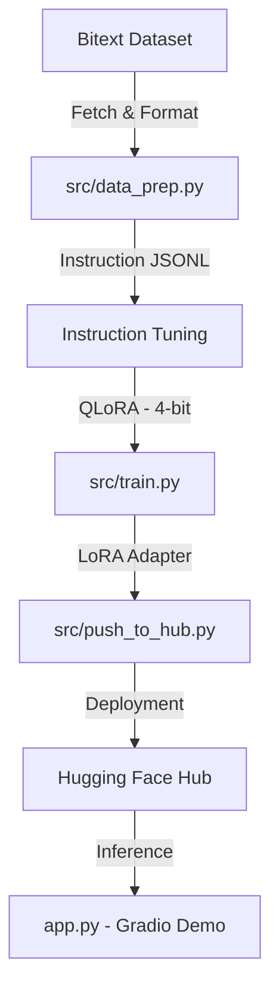

# 🤖 Customer Support Auto-Resolution Model (Fine-Tuning)

> **"Bridging the gap between raw natural language and structured support automation using Mistral-7B."**

This project demonstrates an end-to-end industry-grade workflow for fine-tuning a Large Language Model (LLM) to act as a **Customer Support Specialist**. By leveraging **QLoRA (4-bit Quantization)**, we transform a general-purpose model into a policy-aware agent capable of generating structured JSON responses (Intent, Response, Action) for E-commerce and SaaS support workflows.

---

## 🎨 Interactive Demo & Model Hub
- **🚀 Live Demo (Gradio)**: [Hugging Face Space](https://huggingface.co/spaces/YOUR_HF_USER_NAME/mistral-7b-support-demo)
- **🧠 Fine-tuned Adapter**: [HF Hub Repository](https://huggingface.co/YOUR_HF_USER_NAME/mistral-7b-support-adapter)

*(Replace `YOUR_HF_USER_NAME` with your actual Hugging Face username in scripts and URLs.)*

---

## 🏗️ System Architecture


---

## 🧠 Key Technologies
- **Base Model**: `Mistral-7B-Instruct-v0.2` (Best-in-class 7B efficiency).
- **Optimization**: **QLoRA** (NF4 Quantization + LoRA) to fit training into 16GB VRAM.
- **Library Stack**: `transformers`, `peft`, `trl` (SFTTrainer), `bitsandbytes`.
- **Metrics**: **ROUGE-L** (Structure) and **BERTScore** (Semantics).

---

## 🚀 Step-by-Step Implementation Guide

### 1. Environment Setup (Google Colab / Local)
Ensure you set your environment variables for secure authentication:
```bash
export HF_TOKEN="your_hf_write_token_here"
export HF_USER_NAME="your_hf_username"
```
Install dependencies:
```bash
pip install -r requirements.txt
```

### 2. Data Preparation
Fetch the dataset, apply Mistral templates, and inject synthetic resolution logic:
```bash
python src/data_prep.py
```
*Output: `data/processed/train.jsonl` containing `[INST]` formatted instructions.*

### 3. Fine-Tuning (The Heart of the Project)
Run the QLoRA training loop using parameters defined in `configs/config.yaml`.
```bash
python src/train.py
```
> [!TIP]
> This script uses **Paged AdamW** and **Gradient Checkpointing** to ensure it runs on a single T4 GPU (free Colab tier).

### 4. Evaluation
Quantify the model's accuracy on the test set:
```bash
python src/evaluate.py
```

### 5. Deployment to Hugging Face
Push your adapters and a professionally generated Model Card to the Hub:
```bash
python src/push_to_hub.py
```

### 6. Interactive Demo
Launch the Gradio UI tailored for HF Spaces:
```bash
python app.py --hf_user $HF_USER_NAME
```

---

## 📂 Project Structure
- `configs/config.yaml`: **Single Source of Truth** for all hyperparameters.
- `src/data_prep.py`: Data collection and instruction formatting logic.
- `src/train.py`: The QLoRA training engine.
- `src/push_to_hub.py`: Secure deployment utility.
- `app.py`: Gradio web demo.
- `techNotes.md`: **Researcher's deep-dive** on VRAM physics and LoRA math.


