# Fine-Tuning Mistral-7B: Researcher’s Technical Notes

This document serves as both a high-level technical blog and a rigorous set of researcher notes. We will explore the mechanics of turning a "Generalist" model into a "Support Specialist" using **QLoRA** and **Instruction Tuning**.

---

## Module 1: The Physical Constraint (VRAM Physics)

In engineering, every system is defined by its bottleneck. For Large Language Models, that bottleneck is **Video RAM (VRAM)**. To understand why we fine-tune the way we do, we must first understand the "Cost of a Parameter."

### The Math of Precision (FP32 to 4-bit)
Every one of the 7 billion parameters in Mistral is a mathematical weight. The memory it consumes depends on its **Precision**:

- **FP32 (Full Precision)**: Each weight is a 32-bit float (4 bytes).  
  *Calculation: 7 Billion × 4 bytes = **28 GB**.*
- **FP16/BF16 (Half Precision)**: Each weight is a 16-bit float (2 bytes).  
  *Calculation: 7 Billion × 2 bytes = **14 GB**.*
- **4-bit Quantization**: Each weight is compressed into just 4 bits (0.5 bytes).  
  *Calculation: 7 Billion × 0.5 bytes = **3.5 - 5 GB** (including over-head).*

### Precision Comparison: Bit-Width Visualized
A single parameter's "footprint" in memory shrinks dramatically as we lower precision. This is why we can fit the 28GB model into a standard GPU.

**What’s inside those bits?**
#### FP32 (Full Precision) - 32 Bits
```mermaid
gantt
    title FP32 Bit Structure (1-8-23)
    dateFormat  X
    axisFormat  %s
    section Sign (1)
    S : 0, 1
    section Exponent (8)
    E : 1, 9
    section Mantissa (23)
    M : 9, 32
```

#### FP16 (Half Precision) - 16 Bits
```mermaid
gantt
    title FP16 Bit Structure (1-5-10)
    dateFormat  X
    axisFormat  %s
    section Sign (1)
    S : 0, 1
    section Exponent (5)
    E : 1, 6
    section Mantissa (10)
    M : 6, 16
```

#### 4-bit (NF4) - 4 Bits (The Paradigm Shift)
In **NF4 (NormalFloat 4)**, the 4 bits don't store a "Sign" or "Exponent." Instead, those 4 bits act as a **Lookup Index** into a table of 16 pre-defined values. These values are strategically placed to match the statistical "bell curve" of the model's weights.

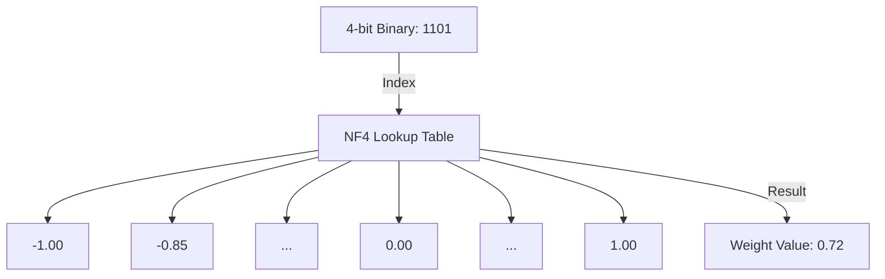

**What are those 4 bits exactly?**
Instead of mathematical components, they represent **1 of 16 discrete states** ($2^4 = 16$):
- **0000 to 1111**: Each binary code points to one of the 16 "optimized" points on the Gaussian curve.
- **Why this works**: A 7B model is highly redundant. We don't need to know if a weight is precisely `0.723456...`; we just need to know it is "roughly in the 13th bin of importance."

**Key Takeaway**: By moving to 4-bit, we aren't just shortening the number; we are changing how information is stored, relying on a **probability distribution** instead of bit-level floating point arithmetic.

### The VRAM Hierarchy: Why 14GB isn't enough for a 16GB GPU
You might think, "If 14GB fits in 16GB, why do we need 4-bit?" The answer lies in the **Training Overhead**:
1. **Model Weights**: The 14GB "Body" of the model.
2. **Optimizer States**: The "Brain" needs memory to calculate updates (e.g., AdamW needs 8 bytes per parameter).
3. **Gradients**: The "Direction" of learning (4 bytes per parameter).
4. **Activations**: Temporary memory used during the forward pass to store intermediate results.

**The Reality**: Training Mistral-7B in FP16 requires nearly **60-80 GB of VRAM**. On platforms like **Google Colab (T4 GPU)** or **Hugging Face Spaces**, we only have **16 GB**.

---

### The Quantization Breakthrough: NF4 & Double Quant
To solve the "38GB model in a 16GB GPU" problem, we use the QLoRA "Holy Trinity." These aren't just simple compression tricks; they are clever exploitations of the model's statistical and hardware properties.

#### 1. Why NormalFloat 4 (NF4) is the "Smarter" Choice
In a standard **INT4 (Integer 4)** quantization, we divide the range [-1, 1] into 16 equally sized buckets. 
- **The Problem**: A well-trained LLM like Mistral has weights that form a **Normal (Gaussian) Distribution**. This means 90% of your weights are clustered around zero, while only a few "Outliers" are near -1 or 1.
- **The Inefficiency**: Equal buckets waste precious precision on the empty edges, while cramming most of the important weights into just 2 or 3 central buckets. This leads to massive information loss.

**💨 The NF4 Solution**: 
NF4 isn't linear. It places its 16 buckets more densely around zero and more sparsely at the edges. 
- **The Analogy**: Imagine taking a photo. A standard quantization is like a cheap fixed-focus lens. NF4 is like a professional "Portrait" lens—it shifts its resolution to where the "Subject" (the most frequent weights) is, while blurring the less important background (the out-of-distribution outliers).

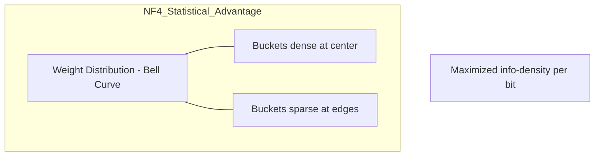

---

#### 2. Double Quantization: The "Inception" of Compression
This is arguably the most "clever" part of the QLoRA paper. To understand it, we need to look at the **Metadata** of quantization.

- **The Problem**: When we compress weights into 4-bit, we can't just leave them like that. We need a **Scaling Factor** (a 32-bit float) for setiap block of weights (usually 64 weights) to tell the model: *"Multiply these 4-bit numbers by X to get the real value."*
- **The VRAM Leak**: In a 7-billion parameter model, you have roughly **110 million** of these scaling factors. 
  - *Calculation: 110M factors × 4 bytes (32-bit) = **~440 MB**.*
  - While 440MB sounds small, on a 16GB GPU already stuffed to the limit, this is often the "tipping point" that causes a crash.

**💨 The Double-Quant Solution**:
We treat these 440MB of scaling factors as just another dataset and **quantize them too!** We compress these 32-bit floats into **8-bit floats**.
- *New Calculation: 110M factors × 1 byte (8-bit) = **~110 MB**.*
- **Outcome**: We just "magically" reclaimed **330 MB** of VRAM. This is why we call it "Inception"—we are quantizing the data that was created by the first round of quantization.

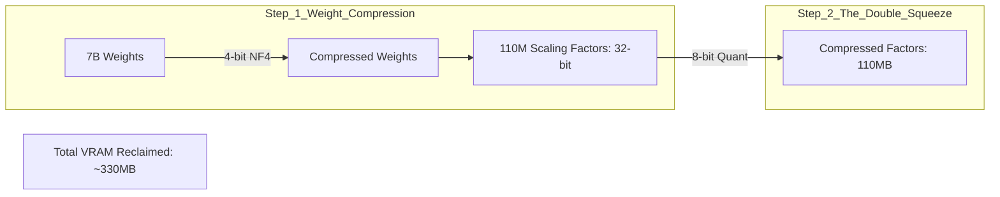

**Researcher's Note**: *Double Quantization is the final 'squeeze'. It's often the single reason we can fit a 7B model onto a free Google Colab instance without a 'Runtime Disconnected' error.*

---

#### 3. Paged Optimizers: The Virtual Memory of GPUs
The most common cause of a training crash is the **Gradient Spike**. During certain mathematical operations, the VRAM usage can suddenly jump by 1-2GB for just a fraction of a second. If your GPU hits 100% capacity at that moment, it errors out (OOM).

- **How it works**: Paged Optimizers leverage the **NVIDIA Unified Memory** feature. When the VRAM hits the limit, the driver "pages" the **Optimizer States** (the largest non-active objects in memory) out to the CPU RAM.
- **The Result**: Instead of a crash, you get a minor "latency hiccup." The training slows down for a second, offloads the data, performs the math, and then pulls the notes back onto the GPU. This transforms a "Fatal Error" into a "Smooth Performance Penalty."

**Summary**: These three technologies—**NF4**, **Double Quantization**, and **Paged Optimizers**—work together like a precision Swiss watch to ensure that every single bit of your 16GB GPU is used to its absolute maximum potential.

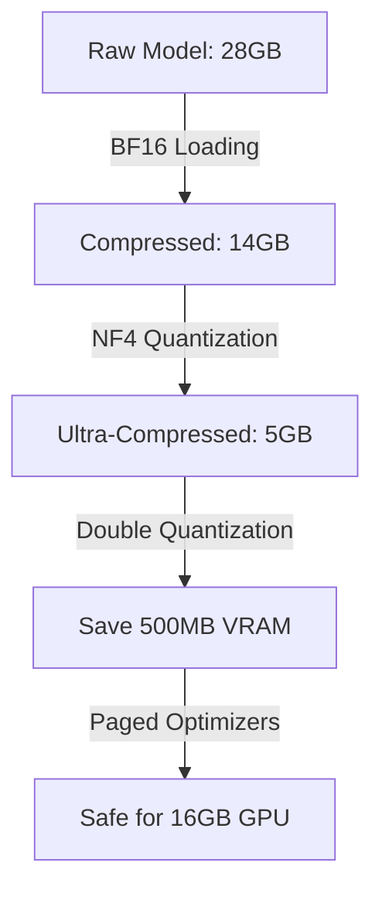

**Researcher's Note**: *Quantization is a trade-off between Precision and Accessibility. By using NF4, we accept a negligible drop in mathematical purity to gain the ability to train on accessible hardware. This is the 'Engineering of the Possible'.*

---

## Module 2: The Geometry of Attention (QKV)

To fine-tune, you must understand the **Self-Attention Mechanism**. The model calculates relationships between words using three projection matrices: **Query (`q_proj`)**, **Key (`k_proj`)**, and **Value (`v_proj`)**.

### The Math of Context
When a word enters the model, it is multiplied by these matrices:
1.  **Query ($Q$)**: "What am I looking for?"
2.  **Key ($K$)**: "What information do I have?"
3.  **Value ($V$)**: "What information should I pass along?"

The Attention Score is calculated as:
$$\text{Attention}(Q, K, V) = \text{softmax}\left(\frac{QK^T}{\sqrt{d_k}}\right)V$$

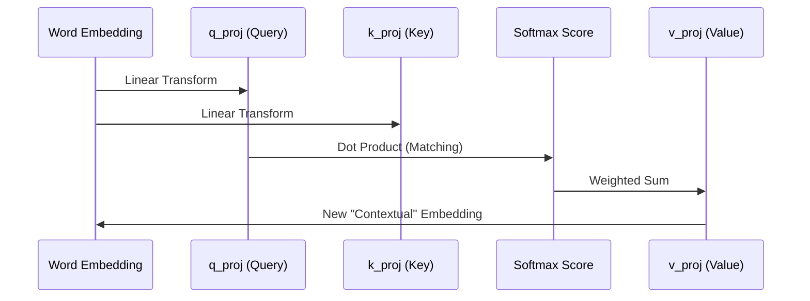

---

## Module 3: Low-Rank Adaptation (LoRA)

Before we talk about memory compression (Quantization), we must talk about the **Fine-Tuning Paradox**: How do we update a model with 7 billion parameters without spending millions of dollars on a compute cluster? 

**The Answer: LoRA (Low-Rank Adaptation)**.

### The "Sticky Note" Analogy (Matrix Decomposition)
Imagine you are a world-class chef (The 7B Model). You already know everything about cooking. Now, a client wants you to cook specifically for a **Vegan Support Event**. 
- You don't need to relearn "How to Chop" or "How to Grill" (the base weights). 
- You just need to keep a small **"Cheat Sheet"** (The Adapter) on your apron that tells you: *"Instead of butter, use oil; instead of milk, use oat milk."*

In the model, we "Freeze" the main brain (the 7B weights). We then add two tiny, low-rank matrices—**Matrix A** and **Matrix B**—parallel to the original layers.

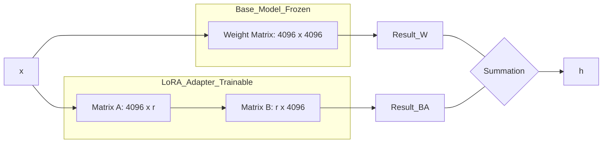

### The Mathematical "Hack" (Rank Reduction)
So why is the number of parameters so much lower? It comes down to a concept called **Intrinsic Dimension** or **Rank**.

#### The "High-Res Photo" Analogy
Imagine you have a high-resolution 20-Megapixel photo (A Full-Rank Matrix).
- If the photo is of a busy city street, every pixel is unique and important to the image. This is a **High-Rank** image.
- However, if the photo is of a **clear blue sky**, almost all the pixels are the same. Even though the file is still 20-Megapixels, the actual "information" in it is very low. You could represent that entire photo with just a few numbers (the blue hex code and a gradient). This is a **Low-Rank** image.

#### Applying this to Mistral
When we fine-tune Mistral for customer support, we aren't changing its entire personality. We are only shifting its focus toward specific jargon and formatting.
- **Full-Rank Update**: Modifying all 16.7 million possible "pixels" of the weight matrix.
- **Low-Rank Update**: We assume the "delta" (the change) we need to make is like that "blue sky" photo. It only has a few "core dimensions" of information.

By setting a **Rank (`r`)** of 16, we forced the model to find the **16 most important dimensions** of change. 
- **The Result**: Instead of calculating $|4096 \times 4096|$, we only calculate two skinny matrices $|4096 \times 16|$ and $|16 \times 4096|$.
- **Total Parameters**: $(4096 \times 16) + (16 \times 4096) = \mathbf{131,072}$. (Down from 16.7 million).

**Researcher's Note**: *By training only 0.8% of the model, we don't just save time; we preserve 'Structural Knowledge'. The model won't forget how to speak English because its 'speaking brain' is frozen. It only learns your 'support behavior' through the adapters.*

---

## Module 4: QLoRA (Quantized LoRA)

Now that we have the efficiency of LoRA, we still have one physical problem: **How do we even LOAD the 28GB model to attach the adapters?** 

This is where **QLoRA** (Quantized Low-Rank Adaptation) comes in. QLoRA is the "Glue" that allows us to run these powerful adapters on top of a 4-bit compressed model.

### The "Holy Trinity" of QLoRA
QLoRA isn't just one trick; it's the combination of three high-end engineering breakthroughs:

1.  **NF4 (NormalFloat 4)**: A data type that "warps" its bit-precision to match the model's bell curve. It ensures that the "Frozen Brain" remains intelligent even when shrunk by 8x.
2.  **Double Quantization**: Reclaiming the final 0.5GB of "leaking" VRAM by quantizing the quantization metadata itself.
3.  **Paged Optimizers**: A GPU-CPU "Virtual Memory" bridge that prevents training from crashing during memory spikes.

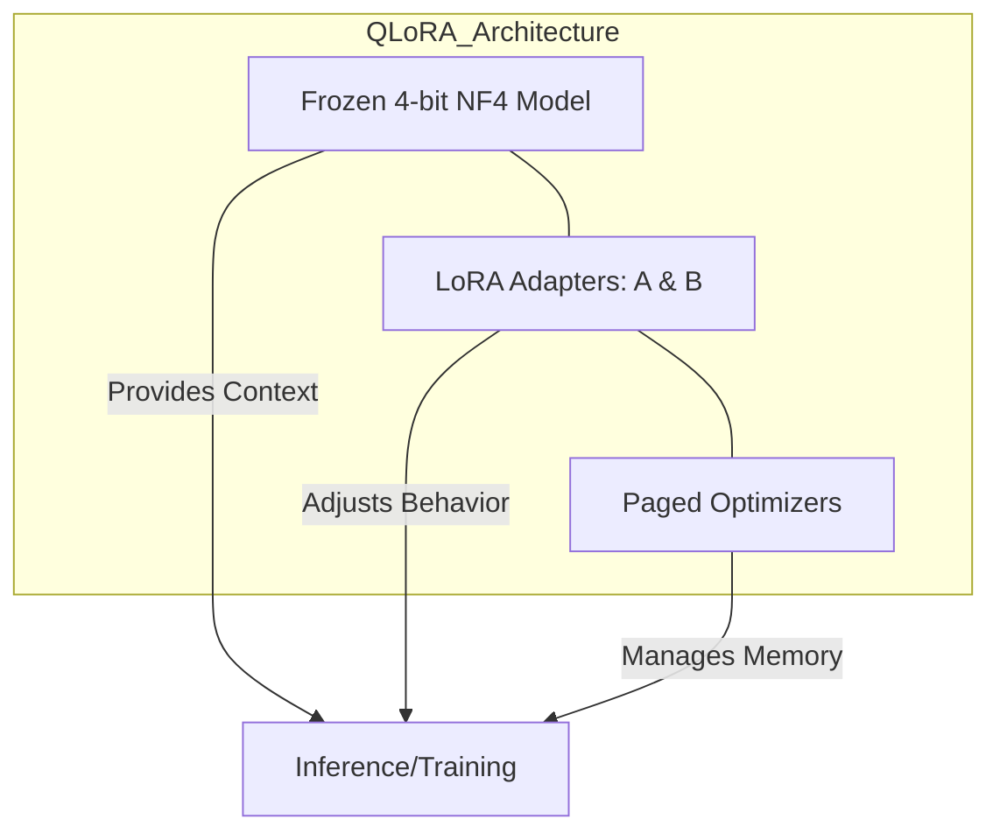

### The Benefits of the QLoRA Approach:
- **Democratization**: You can fine-tune a world-class LLM on a $20/month Google Colab account instead of a $20,000 server.
- **Portability**: Your result is a tiny **150MB file** (the adapter) that can be shared instantly on Hugging Face.
- **Multi-Tenant Serving**: You can load one 5GB base model and "hot-swap" multiple 150MB adapters for different tasks (Support, Sales, Summarization) without reloading the main model.

**Researcher's Note**: *QLoRA is the 'High-Definition' version of compression. It allows us to reach full fine-tuning performance while ignoring 95% of the memory overhead.*

---

## Module 5: The Chat Protocol (Instruction Formatting)

A model's "brain" is one thing; its "behavior" is another. Mistral-7B-Instruct isn't just a language predictor; it's trained to follow a specific **Social Contract** called the Chat Protocol.

### The Anatomy of the Protocol
Mistral uses specific "control tokens" to manage the state of a dialogue. If you get these wrong, the model will treat your instruction as just "more text" to complete, rather than a command to follow.

1.  **`<s>` (BOS - Beginning of Stream)**: This is like a "Hard Reset." It clears the model's internal attention cache, signaling that a brand-new conversation is starting.
2.  **`[INST]` and `[/INST]` (Instruction Markers)**: These are the boundaries of the "Safe Zone." Everything inside is considered a command.  
3.  **`</s>` (EOS - End of Stream)**: The single most important token for support. It signals the model to **STOP**. 

#### 🧩 Visualizing the Sequence:
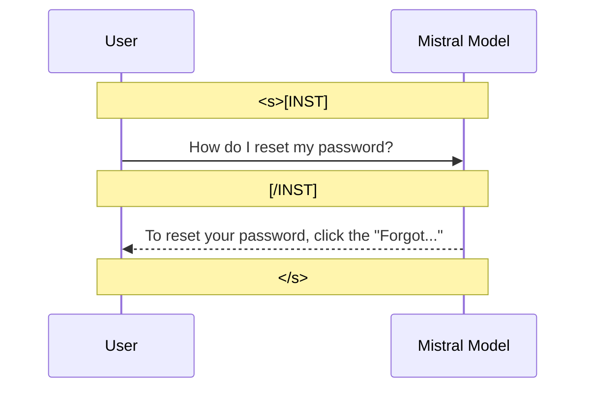

#### The Hallucination Problem (The "Missing Stop" Example):
What happens if you forget the stop token in your training data?

| **Correct Behavior (with `</s>`)** | **Broken Behavior (without `</s>`)** |
| :--- | :--- |
| **User**: How do I reset my password? | **User**: How do I reset my password? |
| **Model**: Click "Forgot..." and follow the link. **[STOP]** | **Model**: Click "Forgot..." and follow the link. **User**: Thanks! **Model**: You're welcome! Let me know if you need... **User**: [hallucinated babbling continues...] |

**Researcher's Note**: *Mistral was trained specifically to attend to these tokens. This is how the model distinguishes between **Knowledge** (internal weights) and **Directives** (external commands). Without the EOS token, the model thinks it's its job to 'keep the story going' instead of 'answering the prompt'.*

---

## Module 6: Hyperparameter Intuition

Why do we choose the numbers we use? Fine-tuning is less like "programming" and more like **"Dialing in a Radio Signal."**

### 1. Learning Rate (e.g., `2e-4`)
In full fine-tuning, you might use a tiny LR like `1e-5`. In LoRA, we use a much higher rate.
- **The Why**: We are only training the tiny adapters. Because we have so few parameters (131k vs 7B), we need a "stronger tug" to get them into the right shape without risking the stability of the main model.

### 2. Gradient Accumulation (The "Virtual Batch")
A T4 GPU can only process a **Batch Size of 4** without running out of memory. But a small batch size results in a "noisy" learning process—the model gets confused by every individual example.

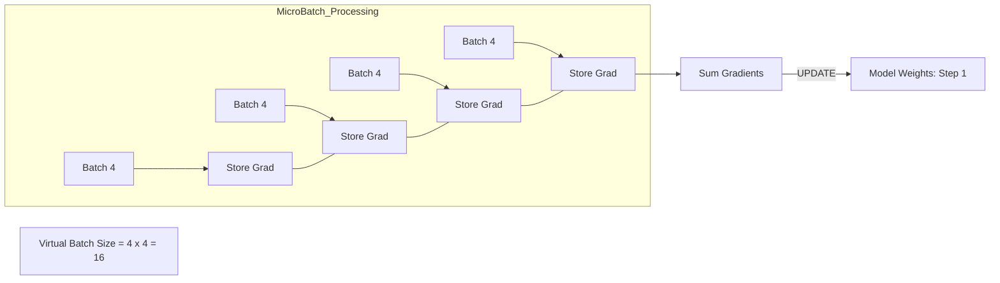

- **The Result**: The model processes 4 examples, stores the math, does it again multiple times, and *then* updates its weights. This transforms 16 tiny, noisy updates into 1 stable, high-quality update.

### 3. Warmup Steps (The "Slow Start")
At the beginning of training, the model's adapters are random noise. If we hit them with a full learning rate immediately, we might "knock the model off balance."

- **The Function**: Warmup allows the model to "find the general direction" of your data before we start sprinting. It's like a runner stretching before a race.

### 4. Weight Decay: The "Memorization" Penalty
When we fine-tune on a small dataset (like 500 support tickets), the model is at high risk of **Overfitting**. It might memorize the exact words of your tickets instead of the underlying strategy.

#### The "Lazy Student" Analogy
Imagine a student preparing for a math test.
- **Without Weight Decay**: The student memorizes the specific answer to every homework problem. If the test has the exact same question, they get 100%. If the test has a *modified* version of the question, they fail completely.
- **With Weight Decay**: We "punish" the student for using too much brainpower on one specific answer. We force them to keep their "logic" simple. This forces them to learn general rules that work for all problems.

#### The Mathematical "Weight"
In the training loss function, we add a tiny penalty based on the **size** of the adapter weights:

$$\text{Total Loss} = \text{Prediction Error} + (\mathbf{\lambda} \times \text{Weight Size}^2)$$

By adding this $\lambda$ (Weight Decay), we are telling the model: *"You can solve the problem, but try to do it with the smallest possible weight values."*

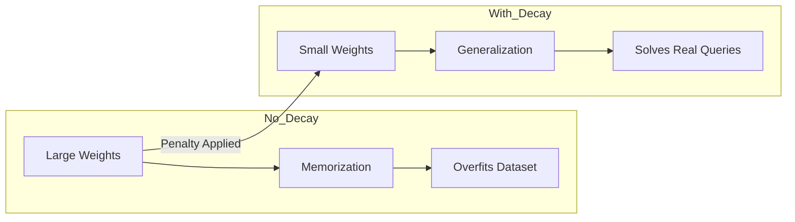

- **The Result**: The model learns to be **robust**. It will understand how to solve a password reset ticket even if the customer uses different words than the ones in your training data.

---

## Module 7: Evaluation & Validation

How do we prove the model is "Better"? In LLM engineering, we don't just "chat" with the model to see if it's good; we use **Scientific Metrics** to measure its performance against a "Golden" dataset (the perfection we want).

### 1. ROUGE-L (The "Literal" Test)
**ROUGE-L** stands for **Recall-Oriented Understudy for Gisting Evaluation**. The "L" refers to the **Longest Common Subsequence**.

- **What it measures**: It looks specifically for the longest sequence of words that appear in BOTH the model's output and the reference answer, in the same order.
- **The Best Use Case**: **Structured JSON Responses**. If your support model needs to output a specific JSON format (e.g., `{"intent": "reset_password"}`), ROUGE-L will strictly penalize it if even one bracket is missing.

#### 🧩 The ROUGE-L Example:
| **Reference (Golden)** | **Model Output** | **ROUGE-L Result** |
| :--- | :--- | :--- |
| "Please reset your password." | "Please reset your secret password." | **High** (Common sequence: "Please reset your... password") |
| "Please reset your password." | "Reset your password please." | **Lower** (The order is broken) |

---

### 2. BERTScore (The "Semantic" Test)
Sometimes two sentences mean the exact same thing but use zero overlapping words. ROUGE-L would give this a score of 0. **BERTScore** solves this by using **Vector Embeddings**.

- **How it works**: It turns every word into a coordinate in a high-dimensional "Meaning Space." 
- **The Concept**: It calculates the **Cosine Similarity** (the angle) between the meaning of the model's words and the meaning of the gold standard words.
- **The Best Use Case**: **Customer Empathy**. If the model says "I'm sorry for the trouble" vs "I apologize for the inconvenience," BERTScore will recognize they are identical in value.

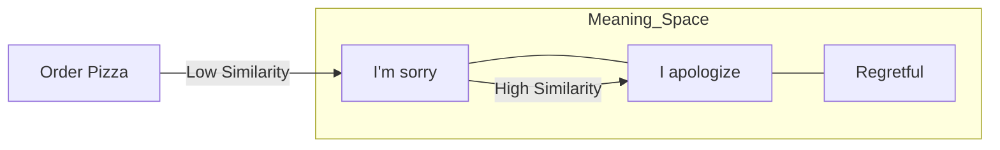

---

### 3. Perplexity (The "Surprise" Test)
Perplexity is the most mathematical metric. It measures how "confident" the model is when it sees your validation data.

- **The Analogy**: Imagine a student taking an exam. 
  - **Low Perplexity**: The student sees a question and immediately knows the answer. They aren't surprised. This means they have **internalized** the logic of the subject.
  - **High Perplexity**: The student is confused and has to guess. This means they haven't learned the patterns of the data.
- **The Goal**: In fine-tuning, we watch the "Loss Curve" or "Perplexity Curve." We want it to drop steadily until it plateaus. If it starts going back *up*, we have hit **Overfitting** (The model is becoming "weirdly specific" and losing its general logic).

#### ❌ Overfitting Visualized:

*Evaluation is a triangulated approach. We use ROUGE-L for 'Correctness,' BERTScore for 'Meaning,' and Perplexity for 'Confidence'. Only when all three are in balance do we have a production-ready support model.*

## Final Conclusion
Fine-tuning is a balance of **Physical Constraints** (Quantization), **Mathematical Efficiency** (LoRA), and **Instructional Clarity** (Data). When done correctly, you end up with a model that is surgically precise, computationally cheap, and behaviorally predictable.

